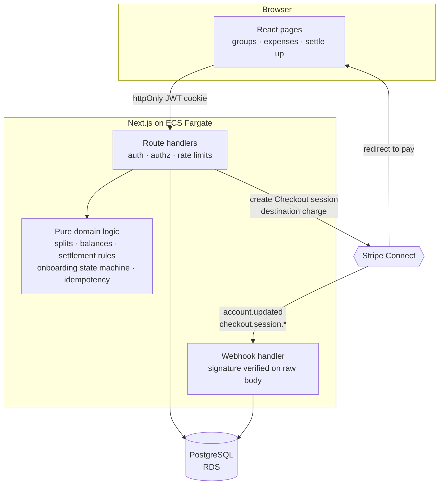

# Squared

Squared splits group expenses like Splitwise, but settling up moves real money. Members log shared expenses with equal, exact-amount, or percentage splits; the app nets everyone's position within a group and reduces the debts to the fewest transfers that clear them; then a member pays what they owe through Stripe Connect, and the funds land in the recipient's connected account. There is no "mark as paid" checkbox — a settlement is a payment or it is nothing.

**Stack:** Next.js (App Router) · TypeScript · Tailwind · PostgreSQL + Drizzle · Stripe Connect · Vitest · Docker · Terraform (ECS Fargate, RDS, Secrets Manager)

---

## Architecture



The parts worth reviewing are deliberately framework-free. `src/lib/` holds the split arithmetic, the balance engine, the settlement rules, the Connect onboarding state machine, and the idempotency contract — all pure functions with no imports from Next.js, Drizzle, or Stripe. Route handlers do authentication, authorization, rate limiting, and persistence, then call into that core. It's testable without a server, and the logic that matters isn't entangled with the framework it happens to be deployed behind.

**Data model.** Seven tables: `users`, `groups`, `group_members`, `expenses`, `expense_shares`, `settlements`, and `stripe_events`. Every amount is an integer count of cents — no float ever touches money. Enum-shaped columns and amount signs are enforced by `CHECK` constraints, and Stripe object ids carry `UNIQUE` constraints, so the database rejects a double-recorded charge even if the application logic above it fails.

---

## The hard parts

### 1. Processing every webhook exactly once

Stripe guarantees *at-least-once* delivery. The same event will arrive twice — after a network timeout, during a retry storm, when someone resends from the dashboard. Processing `checkout.session.completed` twice would mark a settlement paid twice; processing `account.updated` twice is harmless, but you don't get to choose which duplicates arrive.

The obvious implementation is to check a ledger of processed event ids, and it has a bug that only shows up under failure:

```ts
// Wrong — the failure mode is invisible in testing
await recordEvent(event.id);   // committed
await handleEvent(event);      // throws → Stripe retries
                               // → the retry sees the id already recorded
                               // → the event is skipped forever
```

The event is marked processed before the work succeeds. When the handler fails, Stripe's retry finds the id already recorded and skips it — the webhook is silently, permanently dropped. In a payments system that means a settlement stuck in `pending` that no amount of retrying will ever resolve.

The fix is that **recording the event and applying its effects have to be the same transaction**:

```ts
return db.transaction(async (tx) => {
  const isNew = await recordEventOnce(tx, event);  // INSERT ... ON CONFLICT DO NOTHING
  if (!isNew) return "duplicate";                  // skip the handler entirely
  await handle(tx);                                // throws → the ledger row rolls back too
  return "processed";
});
```

Now a duplicate delivery conflicts on the primary key and skips the handler, while a *failed* handler rolls back the ledger row along with everything else, so Stripe's retry finds an unrecorded event and genuinely reprocesses it.

That guarantee is the product, so it's tested as one. [`webhook-idempotency.ts`](src/lib/webhook-idempotency.ts) is written against a small dependency interface rather than against Drizzle, which lets the [tests](src/lib/webhook-idempotency.test.ts) drive it with a fake database that has real commit and rollback semantics — including the case that matters most: *handler fails, ledger must roll back, retry must succeed.* It's also verified against real Postgres with signed payloads: forged signatures rejected, first delivery processed, replays skipped, distinct events processed independently.

### 2. Reducing debts to the fewest transfers

A group of five people with a dozen shared expenses generates a tangle of pairwise debts. Showing them raw means everyone makes several payments — and with real card payments, each one costs a processing fee and a step the user has to complete.

Squared reduces this in two stages, in [`balances.ts`](src/lib/balances.ts). First, collapse everything into one net position per person: for each expense the payer is credited the full amount and every participant is debited their share, then settlements move credit back. Positions always sum to zero, and that's asserted rather than assumed. Second, repeatedly match the **largest debtor** with the **largest creditor** for `min(debt, credit)`. Each match zeroes out at least one person, so `n` participants need at most `n − 1` transfers instead of the pairwise tangle.

A concrete case from the test suite — three roommates, three expenses:

```
Alice paid rent $1500        →  net:  Alice  +$950
Bob paid groceries  $90              Bob    −$460
Carol paid utilities $60             Carol  −$490

Pairwise view:  Bob→Alice, Carol→Alice, Bob→Carol, Carol→Bob …
Simplified:     Carol → Alice  $490.00
                Bob   → Alice  $460.00      (2 transfers, no Bob↔Carol payment)
```

Greedy matching is optimal for the number of *people* who must pay, though minimizing transfer count in the general case is NP-hard (it's partition in disguise). For group sizes that exist in reality — under twenty — this is the right trade: predictable, `O(n log n)` per match with tiny `n`, and easy to explain to a user who wants to know why they're paying the person they are.

The rounding underneath it is its own small correctness problem. Splitting $100 three ways can't be done in cents, so [`splits.ts`](src/lib/splits.ts) uses largest-remainder apportionment: floor every share, then hand out the leftover cents to the largest truncated remainders. Percentages are converted to integer basis points before any arithmetic. The [property test](src/lib/splits.test.ts) checks 3,500 amount-and-group-size combinations to confirm no split ever creates or destroys a cent and no participant is more than one cent from the mean.

### 3. Two people settling the same debt at once

Balance validation reads the current state and then writes a settlement, which is a read-then-write race. If Bob owes Alice $50 and opens checkout twice in two tabs, both requests can read "Bob owes $50", both can approve a $50 settlement, and Alice gets paid twice.

Settlement creation therefore recomputes balances **inside** the transaction that inserts the settlement, serialized per group with `pg_advisory_xact_lock(hashtext(group_id))`. The second request blocks until the first commits, then recomputes against the updated balance and correctly rejects. The amount is also capped at `min(payer debt, recipient credit)`, which preserves the group's zero-sum invariant: no settlement can leave a payer net-positive or a recipient net-negative.

Stripe is called *outside* that transaction — holding a database transaction (and the group's lock) open across a third party's network latency is how you turn a payment provider's slow day into your outage. That leaves a window where the row exists but the charge doesn't, so a Stripe failure marks the settlement `failed`, which returns the debt to the group's balances rather than freezing it behind a pending row no webhook will ever resolve.

### 4. Knowing when someone can actually be paid

A Connect account isn't binary. It has capabilities that Stripe enables independently, after review, sometimes revoking them later. Routing funds to an account that can't receive them fails at checkout, in front of a user who has already committed to paying.

[`stripe-status.ts`](src/lib/stripe-status.ts) reduces the account to `not_started → pending → active/restricted`, driven by `account.updated` webhooks. The subtle case: **a brand-new account has every capability disabled**, so checking capabilities first labels every user who just started onboarding as "restricted." `details_submitted` has to be consulted before drawing that conclusion. Only `active` users can receive settlements, and the UI says which person isn't ready rather than presenting a button that fails.

---

## Running locally

```bash
git clone https://github.com/sameerchohan/squared.git && cd squared
npm install
cp .env.example .env        # then set JWT_SECRET: openssl rand -hex 32
docker compose up -d        # Postgres 16
npm run db:migrate
npm run dev                 # http://localhost:3000
```

```bash
npm test                    # 52 Vitest cases
npm run db:generate         # regenerate migrations after editing src/db/schema.ts
docker build -t squared .   # production image (311 MB, non-root)
```

Settlements need Stripe test keys in `.env` plus a webhook forwarder:

```bash
stripe listen --forward-to localhost:3000/api/stripe/webhook
```

Use card `4242 4242 4242 4242` at checkout. Both parties need to complete Express onboarding before a settlement between them is allowed.

Deployment lives in [`infra/`](infra/) — Terraform for Fargate behind an ALB, RDS in private subnets, secrets injected from Secrets Manager at task start, and a budget alarm so a demo deployment can't quietly run up a bill. It validates but has not been applied; see [`infra/README.md`](infra/README.md) for the deploy runbook, the cost breakdown, and the reasoning behind each trade.

---

## What I'd do differently at scale

**Balances are recomputed from every expense on each read.** Fine for groups of a dozen people and a few hundred expenses, and it keeps the calculation obviously correct — there's no cached total to drift. At a scale where groups accumulate years of history, this becomes a materialized balance per member, updated transactionally as expenses and settlements land, with the full recomputation kept as a reconciliation job that verifies the cache rather than trusting it.

**Webhook handling is synchronous.** The handler does its database work inside the request, and Stripe's retries are the only queue. That's a deliberate simplification: fewer moving parts, and idempotency makes retries safe. Under real volume, the endpoint should verify, enqueue, and return, with workers consuming from SQS and a dead-letter queue catching events that fail repeatedly — the current design silently depends on Stripe eventually giving up.

**Sessions are stateless JWTs, which means they can't be revoked.** A stolen token stays valid until it expires, and "sign out everywhere" is unimplementable. The fix is short-lived access tokens with refresh tokens tracked server-side, so revocation has somewhere to write.

**The rate limiter is in-process.** Limits are per-container, so `n` tasks means `n` times the intended allowance, and a restart forgets everything. Redis moves the counters somewhere shared; WAF rules in front of the load balancer handle the volumetric case before it reaches application code at all.

**The idempotency ledger grows without bound.** Every Stripe event id is kept forever. Since Stripe stops retrying after a few days, rows older than that window serve no purpose and should be aged out — partitioned by month and dropped, rather than accumulating indefinitely in a table on the hot path of every webhook.

**Tasks run in public subnets, and RDS is single-AZ.** Both are cost decisions, and the first is the more interesting one: a NAT gateway costs ~$32/month and buys network topology rather than access control, since the tasks' security group already admits nothing but the load balancer. Flipping `use_nat_gateway` in the Terraform moves them into private subnets — the topology to run with real money, where a compromised task can't be addressed directly even if a security group is later misconfigured, and outbound traffic leaves from a stable IP an upstream provider can allowlist. Multi-AZ RDS is the other change real users would justify. Both paths are in the code because the trade-off, not the default, is the point.

**Everything is USD.** Currency is assumed rather than stored. Supporting more means a currency column on groups, per-currency balances, and a decision about what "settling up" means across currencies — which is a product question before it's a schema question.

**Stripe's processing fee is currently absorbed by the platform.** ~2.9% + 30¢ per settlement, which is fine for a demo and a slow bleed for anything real. The options and the trade-offs between them are laid out in [issue #6](https://github.com/sameerchohan/squared/issues/6).
